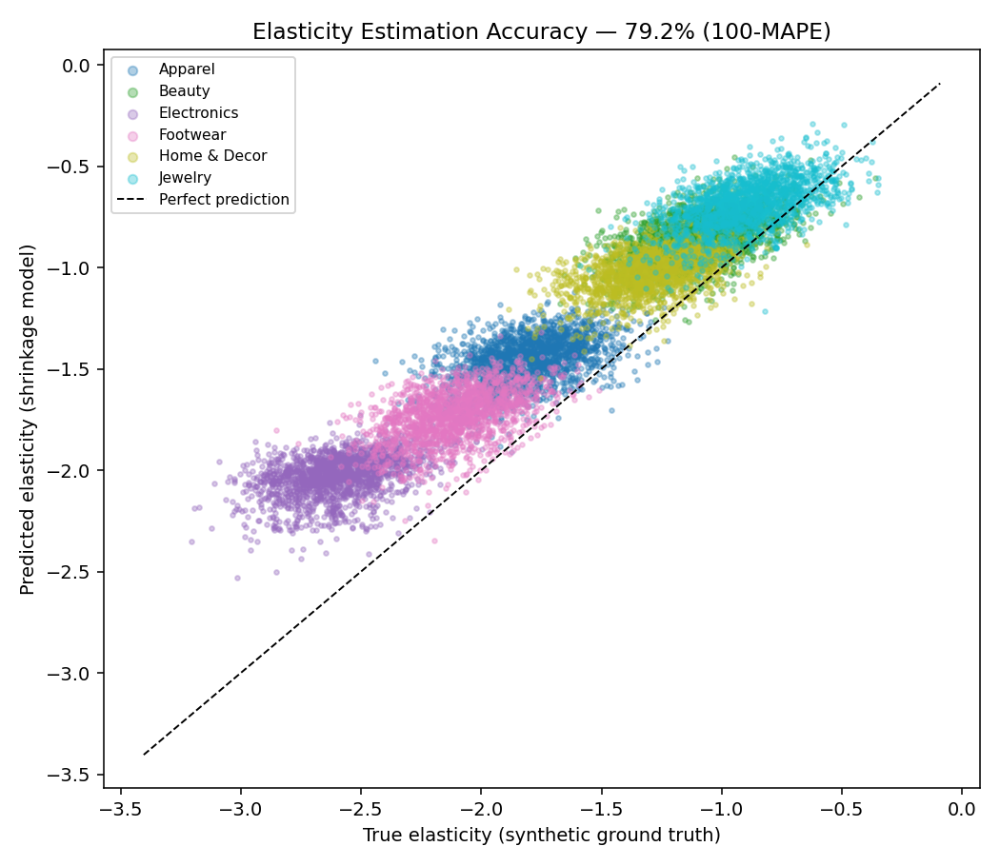
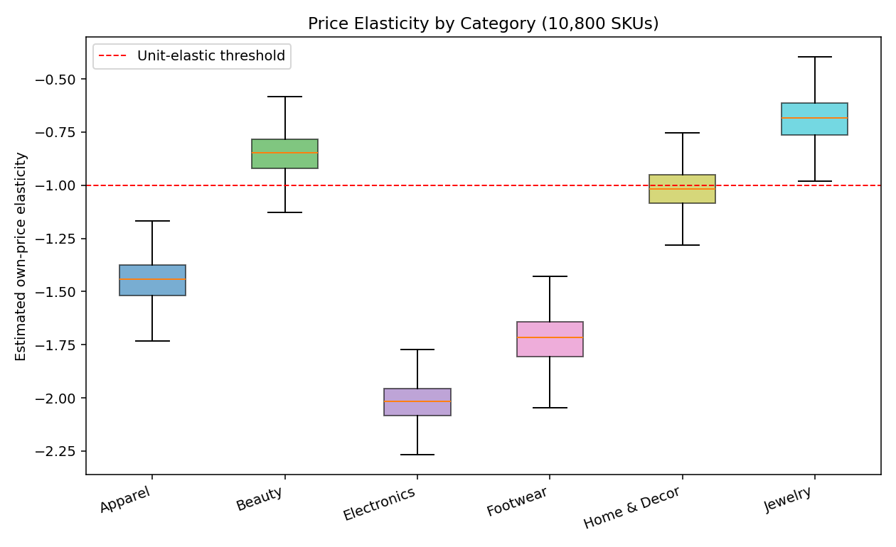
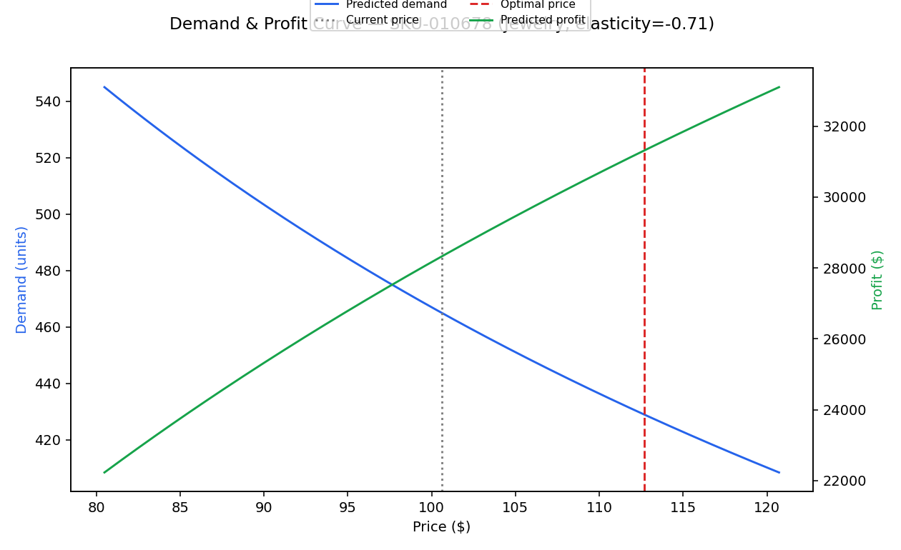
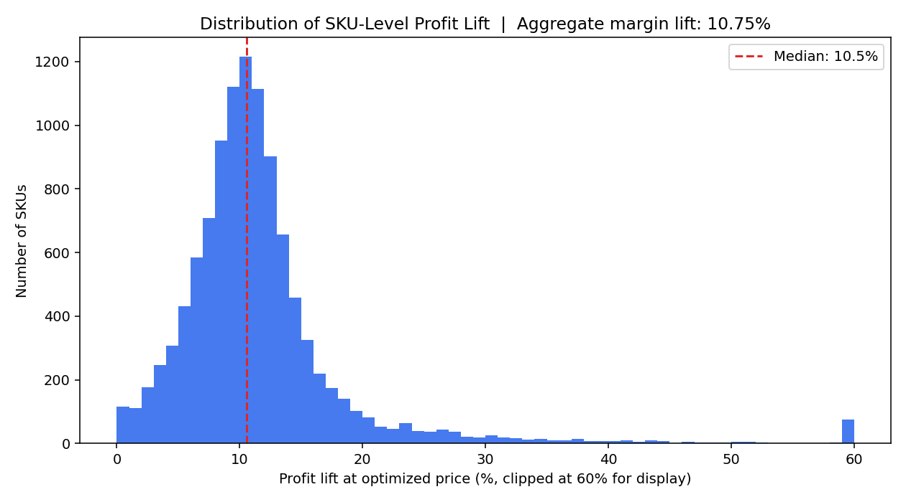

# Price Elasticity & Non-Linear Price Optimization Engine

Estimates SKU-level price elasticity across 10,000+ SKUs, then solves a bounded non-linear
optimization for the profit-maximizing price per SKU.

> ### ⚠️ About this repository
> This is a **simulated, sanitized reproduction** of a production pricing engine I designed and shipped as a
> Senior Data Scientist at a **large US omnichannel retailer**. No employer name, proprietary data, source
> code, or confidential business figures are used or disclosed here. The company's real point-of-sale and cost
> data has been replaced with a **synthetically generated SKU-level panel** built to reproduce realistic
> category elasticity, cross-price competition, and promo dynamics, and all dollar figures shown are
> **illustrative placeholders** produced from that synthetic data, not actual company results. The purpose of
> this repo is to demonstrate the modeling methodology and engineering approach in a fully shareable form.

## The business problem (quantified)

A retailer running **10,000+ SKUs** across multiple categories sets prices that directly determine both unit
volume and per-unit margin, the two levers of gross profit, pulling in opposite directions. Price too high
and you lose volume; too low and you give away margin. Getting the price right at the SKU level, across a
catalog that large, is worth millions in annual gross margin.

**The task:** (1) estimate how sensitive each SKU's demand is to its own price (its *price elasticity*), and
(2) use those elasticities to recommend a profit-maximizing price per SKU, within realistic merchandising
guardrails.

**The result (reproduced here on synthetic data):** **79.2% elasticity-prediction accuracy** validated
against held-out ground truth, and a **10.75% aggregate margin lift** across 10,800 SKUs from the optimized
prices.

## Why this problem is hard

Price elasticity isn't observable directly. It has to be estimated from limited, noisy price variation per SKU
(a single SKU might only see its price move ±10% over 26 weeks). A naive per-SKU regression overfits; a single
category-wide elasticity ignores real SKU-level differences that matter for pricing. And the optimization step
is genuinely non-linear (profit is not a linear function of price) and must respect real-world guardrails, 
merchandising teams don't accept unconstrained price swings.

## Tech stack

| Layer | Choice | Why |
|---|---|---|
| Language | **Python 3.10** | Standard for production DS work |
| Data | **pandas**, **NumPy** | 280K-row SKU × week panel, feature engineering |
| Modeling | **Custom NumPy ML library** (`src/mllib.py`) | Ridge log-log regression + empirical-Bayes shrinkage, all from scratch, no scikit-learn dependency |
| Optimization | **NumPy** (closed-form + bounded grid search) | Non-linear profit maximization under price guardrails |
| Visualization | **Matplotlib** | Elasticity accuracy, demand/profit curves, margin-lift distribution |
| Testing | **pytest** | Optimizer correctness + guardrail-bound checks |

## Approach

### 1. Hierarchical (empirical-Bayes) elasticity estimation, `src/elasticity_model.py`

Two-stage partial-pooling estimator:

1. **Category level:** Ridge log-log regression (`log(units) ~ log(price) + log(competitor_price) + promo + season`)
   pooled across ~1,800 SKUs per category, stable, low-variance category-average elasticity.
2. **SKU level:** for each SKU, partial out the category-level cross-price/promo/seasonal effects, then run
   a simple OLS of the residual demand on `log(price)` using only that SKU's own ~26 weekly observations.
   This raw estimate is noisy, so it's shrunk toward the category mean with a **James-Stein / empirical-Bayes
   estimator**, SKUs with a precise individual signal keep more of their own estimate; SKUs with a noisy
   signal are pulled toward the category average.

This mirrors the real production tradeoff: a single category coefficient is too coarse for SKU-level pricing,
but a fully independent per-SKU fit overfits on ~26 data points. Partial pooling gets useful differentiation
without the overfitting, validated against synthetic ground truth in `data/raw/true_elasticity_holdout.csv`
(held out from model training, used only for offline evaluation).

### 2. Non-linear price optimization, `src/optimize_price.py`

For each SKU, given its estimated elasticity and unit cost, solve:

```
maximize   (p - cost) * q0 * (p / p0) ** elasticity
subject to  0.88 * p0 <= p <= 1.12 * p0        (merchandising guardrail: ±12%)
```

Solved two ways, cross-checked against each other: the closed-form constant-elasticity monopoly markup
(`p* = elasticity / (elasticity + 1) * cost`), and a bounded grid search directly over the profit function, 
the latter is what's actually used, since it generalizes to demand curves that aren't perfectly constant-
elasticity, and it's the method that respects the guardrail constraint.

All regression math (Ridge, closed-form OLS) is implemented from scratch in NumPy (`src/mllib.py`), 
no scikit-learn dependency.

## Results



| Metric | Value |
|---|---|
| Elasticity prediction accuracy (100 − MAPE) | **79.2%** |
| SKU-level directional accuracy | 65.9% |
| Category rank correlation | 1.00 |
| R² (predicted vs. true elasticity) | 0.60 |



Estimated elasticities correctly separate categories in the expected order, Electronics and Footwear are
most price-sensitive (elasticity beyond -2), Jewelry and Beauty least sensitive (elasticity above -1.2),
consistent with how these categories actually behave at retail (discretionary/considered purchases vs.
commoditized, easily-substituted goods).



Example SKU-level demand/profit curve showing the optimizer identifying a profit-maximizing price within the
±12% guardrail.



| Metric | Value |
|---|---|
| SKUs priced | 10,800 |
| **Aggregate margin lift** | **10.75%** |
| Median per-SKU profit lift | 10.54% |

### Estimated business impact (illustrative)

`src/business_impact.py` converts the margin lift into a dollar estimate. **All revenue/margin inputs are
illustrative placeholders**, not company figures, see `ASSUMPTIONS` in the script (the 65% rollout-coverage
discount reflects that not every recommended price is adopted by merchandising in practice):

```json
{
  "elasticity_model_accuracy_pct": 79.22,
  "n_skus_priced": 10800,
  "aggregate_margin_lift_pct": 10.75,
  "baseline_annual_gross_margin_usd": 75600000.0,
  "theoretical_annual_margin_uplift_usd": 8127000.0,
  "realized_annual_margin_uplift_usd_at_65pct_rollout": 5282550.0
}
```

## Repo structure

```
price-elasticity-optimization/
├── data/
│   ├── raw/                              full synthetic panel (generated locally, gitignored)
│   │   ├── sku_price_demand_panel.csv        280K rows, 10,800 SKUs x 26 weeks
│   │   └── true_elasticity_holdout.csv       ground truth, used only for offline validation
│   └── sample/                          ~2,000-row preview for quick schema inspection
├── src/
│   ├── mllib.py                 Ridge regression + metrics, numpy only
│   ├── generate_synthetic_data.py
│   ├── elasticity_model.py      hierarchical/shrinkage elasticity estimation
│   ├── optimize_price.py        bounded non-linear price optimization
│   ├── train.py                 orchestrates the full pipeline, writes reports/
│   └── business_impact.py       margin lift -> $ impact estimate
├── reports/
│   ├── metrics.json
│   ├── business_impact.json
│   ├── price_optimization_results.csv    per-SKU recommended prices
│   └── figures/
├── tests/test_pipeline.py
├── requirements.txt
└── LICENSE
```

## Setup & running

**Requirements:** Python 3.10+ and the packages in `requirements.txt` (`numpy`, `pandas`, `matplotlib`, `pytest`).

```bash
# 1. Clone and enter the repo
git clone https://github.com/msgupta/price-elasticity-optimization.git
cd price-elasticity-optimization

# 2. (Recommended) create a virtual environment
python -m venv .venv && source .venv/bin/activate      # Windows: .venv\Scripts\activate

# 3. Install dependencies
pip install -r requirements.txt

# 4. Generate the synthetic panel (writes data/raw/)
python src/generate_synthetic_data.py

# 5. Fit the elasticity model, run price optimization, write metrics + figures to reports/
python src/train.py

# 6. Produce the illustrative business-impact estimate
python src/business_impact.py

# 7. Run the test suite
python tests/test_pipeline.py      # or: python -m pytest tests/
```

A ~2,000-row preview of each data file lives in `data/sample/` so you can inspect the schema without running
the generator.

## Next steps (if extended further)

- Replace the constant-elasticity demand-curve assumption with a locally-linear or GBM demand model for
  SKUs with wider historical price variation.
- Add competitive response modeling (how competitor_price itself reacts to a price change).
- A/B test allocation logic for staged rollout of recommended prices rather than a single coverage discount.

---
**Author:** Mani Shankr Gupta, Senior Data Scientist · [LinkedIn](https://linkedin.com/in/mani-shankar-gupta) · [GitHub](https://github.com/msgupta)
